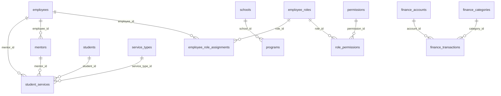

# StudyLandsEdu 数据库完整文档

> 📅 文档生成时间: 2025年10月23日  
> 🔗 数据库URL: https://swyajeiqqewyckzbfkid.supabase.co  
> 🏢 项目名称: StudyLandsEdu 留学管理系统

---

## 📊 数据库概览

### 统计信息

| 指标 | 数值 |
|------|------|
| **数据库类型** | PostgreSQL (via Supabase) |
| **总表数** | 18个 |
| **活跃表数** | 16个 |
| **总记录数** | 6,938+ 条 |
| **认证集成表** | 3个 (employees, students, mentors) |

### 表分类

```
核心业务表 (6个)
├── employees          - 员工管理
├── students           - 学生管理
├── mentors            - 导师库
├── leads              - 客户线索
├── projects           - 项目管理
└── student_services   - 学生服务记录

服务管理表 (2个)
├── service_types      - 服务类型
└── student_services   - 服务实例

学校项目表 (2个)
├── schools            - 学校信息 (174所)
└── programs           - 专业项目 (6,644个)

财务管理表 (3个)
├── finance_accounts       - 财务账户
├── finance_categories     - 财务分类
└── finance_transactions   - 交易记录

权限管理表 (4个)
├── employee_roles             - 角色定义
├── permissions                - 权限定义
├── role_permissions           - 角色权限关联
└── employee_role_assignments  - 员工角色分配

任务管理表 (预留)
├── tasks                  - 任务
├── task_comments          - 任务评论
├── task_attachments       - 任务附件
└── subtasks              - 子任务
```

---

## 🗂️ 详细表结构

### 1. 👥 employees (员工表)

**用途**: 存储公司员工信息，支持Supabase Auth集成

**记录数**: 4  
**字段数**: 17 *(更新: 新增is_mentor)*  
**认证集成**: ✅ (auth_id)

#### 字段详情

| 字段名 | 类型 | 必填 | 说明 | 特殊标记 |
|--------|------|------|------|----------|
| `id` | integer | ✅ | 主键，自增 | 🔑 |
| `auth_id` | uuid | ❌ | Supabase Auth用户ID | 🔐 |
| `name` | text | ✅ | 员工姓名 | |
| `email` | text | ✅ | 邮箱地址 | 📧 唯一 |
| `contact` | text | ❌ | 联系电话 | |
| `gender` | text | ❌ | 性别 | |
| `avatar_url` | text | ❌ | 头像URL | |
| `position` | text | ❌ | 职位 | |
| `department` | text | ❌ | 部门 | |
| `location` | text | ❌ | 工作地点 | |
| `skills` | text[] | ❌ | 技能标签 | |
| `is_active` | boolean | ✅ | 是否在职 | 默认 true |
| `is_partner` | boolean | ✅ | 是否合伙人 | 默认 false |
| `is_mentor` | boolean | ✅ | **新增**: 是否为导师(关联mentors表) | 👨‍🏫 默认 false |
| `created_at` | timestamptz | ✅ | 创建时间 | 📅 自动 |
| `updated_at` | timestamptz | ✅ | 更新时间 | ⏰ 自动 |

#### 自动同步说明

当`is_mentor = true`时,以下字段会自动同步到`mentors`表:
- ✅ `name`, `gender`, `avatar_url`, `location`, `is_active`
- 📝 通过触发器`trigger_sync_employee_to_mentor`实现自动同步
- 🔗 详见: `EMPLOYEE_MENTOR_SYNC.md`

#### 关系

- **一对多** → `student_services.mentor_id`
- **一对多** → `employee_role_assignments.employee_id`
- **一对多** → `mentors.employee_id`

---

### 2. 🎓 students (学生表)

**用途**: 存储学生客户信息，支持Supabase Auth集成

**记录数**: 34  
**字段数**: 18  
**认证集成**: ✅ (auth_id)

#### 字段详情

| 字段名 | 类型 | 必填 | 说明 | 特殊标记 |
|--------|------|------|------|----------|
| `id` | integer | ✅ | 主键，自增 | 🔑 |
| `auth_id` | uuid | ❌ | Supabase Auth用户ID | 🔐 |
| `name` | text | ✅ | 学生姓名 | |
| `email` | text | ❌ | 邮箱地址 | 📧 |
| `contact` | text | ❌ | 联系电话 | |
| `gender` | text | ❌ | 性别 | |
| `avatar_url` | text | ❌ | 头像URL | |
| `student_number` | text | ❌ | 学号 | 唯一 |
| `education_level` | text | ❌ | 学历层次 | |
| `school` | text | ❌ | 当前学校 | |
| `major` | text | ❌ | 专业 | |
| `target_countries` | text[] | ❌ | 目标国家 | |
| `location` | text | ❌ | 所在地 | |
| `address` | text | ❌ | 详细地址 | |
| `status` | text | ✅ | 学生状态 | 活跃/休学/毕业 |
| `is_active` | boolean | ✅ | 是否活跃 | 默认 true |
| `created_at` | timestamptz | ✅ | 创建时间 | 📅 自动 |
| `updated_at` | timestamptz | ✅ | 更新时间 | ⏰ 自动 |

#### 关系

- **一对多** → `student_services.student_id`
- **一对多** → `leads` (潜在关联)

---

### 3. 🎯 service_types (服务类型表)

**用途**: 定义公司提供的服务类型

**记录数**: 10  
**字段数**: 4

#### 字段详情

| 字段名 | 类型 | 必填 | 说明 |
|--------|------|------|------|
| `id` | integer | ✅ | 主键 🔑 |
| `name` | text | ✅ | 服务名称 |
| `description` | text | ❌ | 服务描述 |
| `is_active` | boolean | ✅ | 是否启用 |

#### 示例数据

```json
[
  {"id": 1, "name": "美国本科申请", "is_active": true},
  {"id": 2, "name": "英国研究生申请", "is_active": true},
  {"id": 3, "name": "语言培训", "is_active": true}
]
```

#### 关系

- **一对多** → `student_services.service_type_id`

---

### 4. 📋 student_services (学生服务记录表)

**用途**: 记录学生购买和使用的服务

**记录数**: 27  
**字段数**: 14

#### 字段详情

| 字段名 | 类型 | 必填 | 说明 | 特殊标记 |
|--------|------|------|------|----------|
| `id` | integer | ✅ | 主键 | 🔑 |
| `student_id` | integer | ✅ | 学生ID | 🔗 FK |
| `student_ref_id` | integer | ❌ | 学生引用ID (冗余) | 🔗 |
| `service_type_id` | integer | ✅ | 服务类型ID | 🔗 FK |
| `mentor_id` | integer | ❌ | 负责导师ID | 🔗 FK |
| `mentor_ref_id` | integer | ❌ | 导师引用ID (冗余) | 🔗 |
| `status` | text | ✅ | 服务状态 | 进行中/已完成/已取消 |
| `progress` | integer | ✅ | 进度百分比 | 0-100 |
| `payment_status` | text | ✅ | 支付状态 | 未支付/部分支付/已支付 |
| `enrollment_date` | date | ❌ | 报名日期 | |
| `end_date` | date | ❌ | 结束日期 | |
| `detail_data` | jsonb | ❌ | 详细数据 | JSON存储 |
| `created_at` | timestamptz | ✅ | 创建时间 | 📅 |
| `updated_at` | timestamptz | ✅ | 更新时间 | ⏰ |

#### 关系

- **多对一** ← `students.id`
- **多对一** ← `service_types.id`
- **多对一** ← `mentors.id`

---

### 5. 👨‍🏫 mentors (导师表)

**用途**: 存储导师/顾问信息

**记录数**: 4  
**字段数**: 16 *(更新: 新增location和service_scope)*  
**认证集成**: ✅ (email)

#### 字段详情

| 字段名 | 类型 | 必填 | 说明 |
|--------|------|------|------|
| `id` | integer | ✅ | 主键 🔑 |
| `employee_id` | integer | ❌ | 关联员工ID 🔗 |
| `name` | text | ✅ | 导师姓名 |
| `email` | text | ❌ | 邮箱 📧 |
| `contact` | text | ❌ | 联系方式 |
| `gender` | text | ❌ | 性别 |
| `avatar_url` | text | ❌ | 头像URL |
| `bio` | text | ❌ | 个人简介 |
| `specializations` | text[] | ❌ | 专业方向 |
| `expertise_level` | text | ❌ | 专业级别 |
| `hourly_rate` | numeric | ❌ | 时薪 |
| `is_active` | boolean | ✅ | 是否活跃 |
| `location` | varchar(255) | ❌ | **新增**: 地理位置 📍 |
| `service_scope` | text[] | ❌ | **新增**: 服务范围(留学申请/课业辅导/科研/语言培训) 💼 |
| `created_at` | timestamptz | ✅ | 创建时间 📅 |
| `updated_at` | timestamptz | ✅ | 更新时间 ⏰ |

#### 关系

- **一对一** ← `employees.id`
- **一对多** → `student_services.mentor_id`

---

### 6. 🏫 schools (学校表)

**用途**: 存储全球院校信息

**记录数**: 174  
**字段数**: 16

#### 字段详情

| 字段名 | 类型 | 必填 | 说明 |
|--------|------|------|------|
| `id` | integer | ✅ | 主键 🔑 |
| `en_name` | text | ✅ | 英文名称 |
| `cn_name` | text | ❌ | 中文名称 |
| `country` | text | ✅ | 国家 |
| `region` | text | ❌ | 地区/州 |
| `city` | text | ❌ | 城市 |
| `ranking` | integer | ❌ | 综合排名 |
| `qs_rank_2024` | integer | ❌ | 2024 QS排名 |
| `qs_rank_2025` | integer | ❌ | 2025 QS排名 |
| `website_url` | text | ❌ | 官网链接 |
| `logo_url` | text | ❌ | 校徽URL |
| `description` | text | ❌ | 学校描述 |
| `tags` | text[] | ❌ | 标签 |
| `is_verified` | boolean | ✅ | 是否已验证 |
| `created_at` | timestamptz | ✅ | 创建时间 📅 |
| `updated_at` | timestamptz | ✅ | 更新时间 ⏰ |

#### 关系

- **一对多** → `programs.school_id`

#### 示例数据

```json
{
  "id": 1,
  "en_name": "University of Cambridge",
  "cn_name": "剑桥大学",
  "country": "英国",
  "city": "Cambridge",
  "qs_rank_2025": 2,
  "is_verified": true
}
```

---

### 7. 📚 programs (专业项目表)

**用途**: 存储院校的专业项目详情

**记录数**: 6,644  
**字段数**: 20

#### 字段详情

| 字段名 | 类型 | 必填 | 说明 |
|--------|------|------|------|
| `id` | integer | ✅ | 主键 🔑 |
| `school_id` | integer | ✅ | 学校ID 🔗 FK |
| `en_name` | text | ✅ | 英文名称 |
| `cn_name` | text | ❌ | 中文名称 |
| `degree` | text | ❌ | 学位类型 (本科/硕士/博士) |
| `category` | text | ❌ | 专业类别 |
| `faculty` | text | ❌ | 所属学院 |
| `duration` | text | ❌ | 学制 |
| `entry_month` | text | ❌ | 入学月份 |
| `tuition_fee` | text | ❌ | 学费 |
| `language_requirements` | text | ❌ | 语言要求 |
| `apply_requirements` | text | ❌ | 申请要求 |
| `curriculum` | text | ❌ | 课程设置 |
| `objectives` | text | ❌ | 培养目标 |
| `analysis` | text | ❌ | 项目分析 |
| `interview` | text | ❌ | 面试要求 |
| `url` | text | ❌ | 项目链接 |
| `tags` | text[] | ❌ | 标签 |
| `created_at` | timestamptz | ✅ | 创建时间 📅 |
| `updated_at` | timestamptz | ✅ | 更新时间 ⏰ |
| `career` | text | ❌ | 未来职业发展  |

#### 关系

- **多对一** ← `schools.id`
- **一对多** → `success_cases.program_id`

---

### 8. 💰 财务管理表

#### 8.1 finance_accounts (财务账户)

**记录数**: 3  
**字段**: id, name, type, balance, is_active

```json
[
  {"id": 1, "name": "银行账户", "type": "银行", "balance": 0},
  {"id": 2, "name": "微信支付", "type": "电子钱包", "balance": 0},
  {"id": 3, "name": "支付宝", "type": "电子钱包", "balance": 0}
]
```

#### 8.2 finance_categories (财务分类)

**记录数**: 4  
**字段**: id, name, description, direction, is_active

```json
[
  {"id": 1, "name": "服务收入", "direction": "收入"},
  {"id": 2, "name": "咨询收入", "direction": "收入"},
  {"id": 3, "name": "办公支出", "direction": "支出"},
  {"id": 4, "name": "人力成本", "direction": "支出"}
]
```

#### 8.3 finance_transactions (交易记录)

**记录数**: 0 (空表)  
**用途**: 记录所有财务交易

---

### 9. 📞 leads (客户线索表)

**用途**: 管理潜在客户信息和跟进状态

**记录数**: 3  
**字段数**: 16 *(更新: 新增email)*

#### 字段详情

| 字段名 | 类型 | 说明 |
|--------|------|------|
| `id` | integer | 主键 🔑 |
| `name` | text | 姓名(必填) ✅ |
| `email` | text | **新增**: 邮箱地址 📧 |
| `phone` | text | 电话 |
| `gender` | text | 性别 |
| `avatar_url` | text | 头像 |
| `interest` | integer | 感兴趣的服务(关联service_types表) 🔗 |
| `source` | text | 来源渠道 |
| `status` | text | 状态 (new/contacted/qualified/converted/closed) |
| `priority` | text | 优先级 (high/medium/low) |
| `assigned_to` | integer | 负责人(关联mentors表) 🔗 |
| `date` | timestamptz | 接入日期 |
| `last_contact` | timestamptz | 最后联系时间 |
| `notes` | text | 备注 |
| `created_at` | timestamptz | 创建时间 📅 |
| `updated_at` | timestamptz | 更新时间 ⏰ |

---

### 10. 📁 projects (项目表)

**用途**: 管理服务项目

**记录数**: 2  
**字段数**: 8

#### 字段详情

| 字段名 | 类型 | 说明 |
|--------|------|------|
| `id` | integer | 主键 🔑 |
| `name` | text | 项目名称 |
| `status` | text | 项目状态 |
| `client_id` | integer | 客户ID 🔗 |
| `start_date` | date | 开始日期 |
| `end_date` | date | 结束日期 |
| `total_amount` | numeric | 项目金额 |
| `created_at` | timestamptz | 创建时间 📅 |

---

### 11. 🔐 权限管理表

#### 11.1 employee_roles (员工角色)

**记录数**: 4  
**字段**: id, name, description, created_at, updated_at

#### 11.2 permissions (权限定义)

**记录数**: 14  
**字段**: id, code, description, created_at, updated_at

#### 11.3 role_permissions (角色权限关联)

**记录数**: 14  
**字段**: id, role_id 🔗, permission_id 🔗

#### 11.4 employee_role_assignments (员工角色分配)

**记录数**: 5  
**字段**: id, employee_id 🔗, role_id 🔗

---

## 🔗 表关系图



---

## 📊 核心业务流程

### 1. 用户认证流程

```
Supabase Auth
    ↓
auth_id 验证
    ↓
employees 或 students 表
    ↓
权限验证 (employees only)
    ↓
系统功能访问
```

### 2. 学生服务流程

```
leads (线索)
    ↓ 转化
students (学生)
    ↓ 购买服务
student_services
    ↓ 分配
mentors (导师)
    ↓ 进度跟踪
服务完成
```

### 3. 选校申请流程

```
schools (174所)
    ↓
programs (6,644个)
    ↓ 筛选匹配
推荐方案
    ↓
申请提交
    ↓
success_cases (案例)
```

---

## 🔧 API使用示例

### 初始化Supabase客户端

```javascript
import { createClient } from '@supabase/supabase-js';

const supabaseUrl = 'https://swyajeiqqewyckzbfkid.supabase.co';
const supabaseKey = process.env.VITE_SUPABASE_ANON_KEY;

export const supabase = createClient(supabaseUrl, supabaseKey);
```

### 常用查询示例

#### 1. 获取学生及其服务

```javascript
const { data, error } = await supabase
  .from('students')
  .select(`
    *,
    student_services (
      *,
      service_types (*),
      mentors (*)
    )
  `)
  .eq('is_active', true);
```

#### 2. 获取学校及其专业

```javascript
const { data, error } = await supabase
  .from('schools')
  .select(`
    *,
    programs (*)
  `)
  .eq('country', '英国')
  .order('qs_rank_2025');
```

#### 3. 获取员工权限

```javascript
const { data, error } = await supabase
  .from('employees')
  .select(`
    *,
    employee_role_assignments (
      employee_roles (
        *,
        role_permissions (
          permissions (*)
        )
      )
    )
  `)
  .eq('auth_id', userId)
  .single();
```

---

## 📈 数据统计

### 记录分布

| 表名 | 记录数 | 占比 |
|------|--------|------|
| programs | 6,644 | 95.8% |
| schools | 174 | 2.5% |
| students | 34 | 0.5% |
| student_services | 27 | 0.4% |
| permissions | 14 | 0.2% |
| role_permissions | 14 | 0.2% |
| service_types | 10 | 0.1% |
| employee_role_assignments | 5 | 0.07% |
| employees | 4 | 0.06% |
| mentors | 4 | 0.06% |
| employee_roles | 4 | 0.06% |
| finance_categories | 4 | 0.06% |
| finance_accounts | 3 | 0.04% |
| leads | 3 | 0.04% |
| projects | 2 | 0.03% |

### 存储空间估算

- **programs表**: ~200MB (6,644条详细记录)
- **schools表**: ~5MB (174条记录)
- **其他表**: ~2MB
- **总计**: ~207MB

---

## ⚠️ 重要提示

### 空表

- `finance_transactions` - 财务交易记录表为空，需要初始化数据

### 不存在的表

- `chat_channels` - 聊天频道 (规划中)
- `chat_messages` - 聊天消息 (规划中)

### 任务管理表 (代码中使用，需要确认)

- `tasks`
- `task_comments`
- `task_attachments`
- `subtasks`

---

## 🚀 最佳实践

### 1. 查询优化

- 使用索引字段进行查询 (id, auth_id, email)
- 限制返回字段 `.select('id, name, email')`
- 使用分页 `.range(0, 9)`

### 2. 数据安全

- 启用RLS (Row Level Security)
- 使用服务端环境变量存储敏感信息
- 定期备份数据

### 3. 性能优化

- 为常用查询创建数据库视图
- 使用 Supabase Realtime 订阅实时数据
- 合理使用 JSONB 字段

---

## 🎯 功能模块数据使用

### Dashboard（控制台）

**数据来源表**：
- `students` - 获取活跃学生数统计
- `leads` - 获取本月线索数
- `student_services` - 获取本月签约数、最新服务动态
- `finance_transactions` - 获取本月收入（计划中）

**相关文件**：
- `src/pages/admin/Dashboard/` - 模块化Dashboard
- `src/pages/admin/Dashboard/services/dashboardService.ts` - 数据服务层
- `src/pages/admin/Dashboard/hooks/useDashboardData.ts` - 数据管理Hook
- `src/pages/admin/Dashboard/components/QuickActionsModal/` - 快捷操作模态框

**快捷操作功能**：
1. **添加学生** - 打开学生添加表单，直接创建新学生记录到 `students` 表
2. **快速创建任务** - 打开任务创建表单，直接创建新任务到 `tasks` 表
3. **新增线索** - 打开线索添加表单，直接创建新线索到 `leads` 表

**数据交互**：
- 创建成功后自动刷新统计数据
- 创建成功后自动刷新最新动态
- 使用 toast 通知用户操作结果

**更新时间**: 2025-10-23

---

## 🎓 申请进度管理表

### 19. 📋 student_profile (学生申请档案表)

**用途**: 存储学生的完整申请档案信息

**记录数**: 1+  
**字段数**: 30+  
**新增时间**: 2025-10-23

#### 字段详情

| 字段名 | 类型 | 必填 | 说明 | 特殊标记 |
|--------|------|------|------|----------|
| `id` | integer | ✅ | 主键 | 🔑 自增 |
| `student_id` | integer | ✅ | 学生ID | 🔗 FK → students |
| **基本信息** |
| `full_name` | text | ✅ | 姓名 | |
| `gender` | text | ❌ | 性别 | |
| `date_of_birth` | date | ❌ | 出生日期 | |
| `nationality` | text | ❌ | 国籍 | |
| `phone_number` | text | ❌ | 电话 | |
| `application_email` | text | ❌ | 申请邮箱 | |
| `passport_number` | text | ❌ | 护照号码 | |
| `current_address` | text | ❌ | 现居地址 | |
| **本科教育背景** |
| `undergraduate_degree` | text | ❌ | 学历 | |
| `undergraduate_school` | text | ❌ | 学校 | |
| `undergraduate_major` | text | ❌ | 专业 | |
| `undergraduate_gpa` | numeric | ❌ | GPA | |
| `undergraduate_score` | numeric | ❌ | 均分 | |
| `undergraduate_start_date` | date | ❌ | 开始时间 | |
| `undergraduate_end_date` | date | ❌ | 结束时间 | |
| `undergraduate_core_courses` | text[] | ❌ | 核心课程 | |
| `undergraduate_scholarships` | text[] | ❌ | 奖学金 | |
| **硕士教育背景** |
| `graduate_degree` | text | ❌ | 学历 | |
| `graduate_school` | text | ❌ | 学校 | |
| `graduate_major` | text | ❌ | 专业 | |
| `graduate_gpa` | numeric | ❌ | GPA | |
| `graduate_score` | numeric | ❌ | 均分 | |
| `graduate_start_date` | date | ❌ | 开始时间 | |
| `graduate_end_date` | date | ❌ | 结束时间 | |
| `graduate_core_courses` | text[] | ❌ | 核心课程 | |
| `graduate_scholarships` | text[] | ❌ | 奖学金 | |
| **标化成绩** |
| `standardized_tests` | jsonb | ❌ | 标化考试成绩 | 🎯 新增 2025-10-25 |
| **文书材料** |
| `document_files` | jsonb | ❌ | 文书材料列表 | |
| **实习/工作经历** |
| `work_experiences` | jsonb | ❌ | 工作经历列表 | 🎯 新增 2025-10-24 |
| `created_at` | timestamptz | ✅ | 创建时间 | 📅 自动 |
| `updated_at` | timestamptz | ✅ | 更新时间 | ⏰ 自动 |

#### JSONB 字段结构

**standardized_tests** (标化成绩):
```json
[
  {
    "test_type": "IELTS|TOEFL|GRE|GMAT|CET4|CET6|OTHER",
    "test_date": "2024-03-15",
    "total_score": 7.5,
    "listening_score": 8.0,      // IELTS/TOEFL
    "reading_score": 7.5,         // IELTS/TOEFL
    "writing_score": 7.0,         // IELTS/TOEFL
    "speaking_score": 7.5,        // IELTS/TOEFL
    "verbal_score": 160,          // GRE
    "quantitative_score": 168,    // GRE
    "analytical_writing_score": 4.5, // GRE
    "has_account": true,
    "account": "test@example.com",
    "password": "password123",
    "other_test_name": "考试名称"  // OTHER类型时
  }
]
```

**work_experiences** (工作经历):
```json
[
  {
    "company": "公司名称",
    "position": "职位",
    "start_date": "2023-01-01",
    "end_date": "2024-01-01",
    "is_current": false,
    "description": "工作描述",
    "achievements": ["成就1", "成就2"]
  }
]
```

**document_files** (文书材料):
```json
[
  {
    "name": "个人陈述",
    "url": "https://...",
    "type": "pdf",
    "upload_date": "2024-10-23",
    "size": 1024000
  }
]
```

#### 关系

- **多对一** → `students.id` (外键: student_id)
- **一对多** → `student_meetings.student_id`
- **一对多** → `final_university_choices.student_id`
- **一对多** → `application_documents_checklist.student_id`

#### 索引

- `PRIMARY KEY (id)`
- `UNIQUE (student_id)`
- `GIN INDEX (standardized_tests)` - 提高 JSONB 查询性能
- `GIN INDEX (work_experiences)` - 提高 JSONB 查询性能
- `GIN INDEX (document_files)` - 提高 JSONB 查询性能

---

### 20. 📅 student_meetings (学生会议表)

**用途**: 记录学生的会议和咨询记录

**记录数**: 0+  
**字段数**: 12  
**新增时间**: 2025-10-23

#### 字段详情

| 字段名 | 类型 | 必填 | 说明 |
|--------|------|------|------|
| `id` | integer | ✅ | 主键 🔑 |
| `student_id` | integer | ✅ | 学生ID 🔗 |
| `title` | text | ✅ | 会议标题 |
| `summary` | text | ❌ | 会议概要 |
| `start_time` | timestamptz | ✅ | 开始时间 |
| `end_time` | timestamptz | ❌ | 结束时间 |
| `participants` | text[] | ❌ | 参会人 |
| `meeting_documents` | jsonb | ❌ | 会议文档 |
| `meeting_notes` | text | ❌ | 会议笔记 |
| `meeting_type` | text | ❌ | 会议类型 |
| `status` | text | ❌ | 状态 |
| `created_at` | timestamptz | ✅ | 创建时间 |
| `updated_at` | timestamptz | ✅ | 更新时间 |

---

### 21. 🏫 final_university_choices (最终选校列表)

**用途**: 存储学生最终确定的申请学校列表

**记录数**: 5+  
**字段数**: 18  
**新增时间**: 2025-10-23

#### 字段详情

| 字段名 | 类型 | 必填 | 说明 |
|--------|------|------|------|
| `id` | integer | ✅ | 主键 🔑 |
| `student_id` | integer | ✅ | 学生ID 🔗 |
| `school_name` | text | ✅ | 学校名称 |
| `program_name` | text | ✅ | 专业名称 |
| `program_level` | text | ❌ | 专业级别 |
| `application_deadline` | date | ❌ | 申请截止日期 |
| `application_round` | text | ❌ | 申请轮次 |
| `application_account` | text | ❌ | 申请账号 |
| `application_password` | text | ❌ | 申请密码 |
| `submission_status` | text | ❌ | 投递状态 |
| `submission_date` | date | ❌ | 投递日期 |
| `decision_date` | date | ❌ | 决定日期 |
| `decision_result` | text | ❌ | 决定结果 |
| `application_type` | text | ❌ | 申请类型 |
| `priority_rank` | integer | ❌ | 优先级 |
| `notes` | text | ❌ | 备注 |
| `created_at` | timestamptz | ✅ | 创建时间 |
| `updated_at` | timestamptz | ✅ | 更新时间 |

---

### 22. 📄 application_documents_checklist (申请材料清单)

**用途**: 追踪学生申请材料的准备进度

**记录数**: 0+  
**字段数**: 13  
**新增时间**: 2025-10-23

#### 字段详情

| 字段名 | 类型 | 必填 | 说明 |
|--------|------|------|------|
| `id` | integer | ✅ | 主键 🔑 |
| `student_id` | integer | ✅ | 学生ID 🔗 |
| `university_choice_id` | integer | ❌ | 选校ID 🔗 |
| `document_name` | text | ✅ | 材料名称 |
| `document_type` | text | ❌ | 材料类型 |
| `is_required` | boolean | ❌ | 是否必需 |
| `status` | text | ❌ | 状态 |
| `progress` | integer | ❌ | 进度 (0-100) |
| `due_date` | date | ❌ | 截止日期 |
| `completed_date` | date | ❌ | 完成日期 |
| `file_url` | text | ❌ | 文件URL |
| `notes` | text | ❌ | 备注 |
| `created_at` | timestamptz | ✅ | 创建时间 |
| `updated_at` | timestamptz | ✅ | 更新时间 |

---

## 📞 技术支持

- **Supabase文档**: https://supabase.com/docs
- **项目仓库**: [GitHub链接]
- **数据库管理**: Supabase Dashboard

---

*本文档最后更新: 2025年10月25日*

