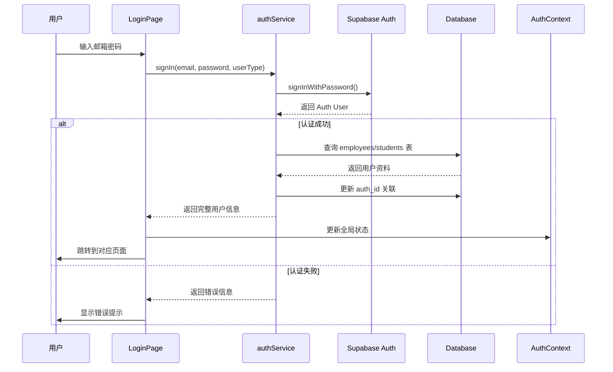

# Supabase 认证系统实现总结

## 🎉 完成状态

**所有功能已完成!** ✅

## 📦 已创建的文件

### 1. 核心服务
- ✅ `src/services/authService.ts` - 完整的认证服务
  - `signIn()` - 登录功能
  - `signUp()` - 注册功能  
  - `signOut()` - 登出功能
  - `resetPassword()` - 密码重置
  - `updatePassword()` - 更新密码
  - `getCurrentUser()` - 获取当前用户
  - `onAuthStateChange()` - 监听认证状态

### 2. UI 页面
- ✅ `src/pages/LoginPage.tsx` - 登录页(已更新为真实Supabase认证)
- ✅ `src/pages/RegisterPage.tsx` - 注册页(全新创建)
- ✅ `src/pages/ForgotPasswordPage.tsx` - 忘记密码页(全新创建)

### 3. 状态管理
- ✅ `src/context/AuthContext.tsx` - 认证上下文
  - 提供全局认证状态
  - 自动同步到localStorage
  - 监听Supabase Auth状态变化

### 4. 路由配置
- ✅ `src/AppRoutes.tsx` - 已更新
  - 添加 `/register` 路由
  - 添加 `/forgot-password` 路由

### 5. 文档
- ✅ `SUPABASE_AUTH_SETUP.md` - 详细配置指南
- ✅ `README.md` - 已更新,添加认证系统说明

## 🔧 实现的功能

### 1. 用户登录 ✅
- 使用 Supabase Auth 的邮箱密码登录
- 自动关联到 `employees` 或 `students` 表
- 根据用户类型跳转不同页面
- 错误处理和友好提示

### 2. 用户注册 ✅
- 学生可以自助注册
- 自动创建 Auth 用户和 students 记录
- 发送邮箱验证
- 注册成功后自动跳转

### 3. 忘记密码 ✅
- 发送密码重置邮件
- 安全的密码重置流程
- 友好的用户界面

### 4. 认证状态管理 ✅
- AuthContext 提供全局状态
- 自动监听 Supabase Auth 变化
- 同步到 localStorage
- 提供 `useAuth` Hook 方便使用

### 5. 数据库关联 ✅
- Auth 用户通过 `auth_id` 关联业务表
- 登录时自动查询和关联
- 注册时自动创建关联
- 支持 employees 和 students 两种用户类型

## 🎯 架构设计

```
┌─────────────────────────────────────────────────────────┐
│                     前端应用                              │
│                                                          │
│  ┌──────────────┐    ┌──────────────┐   ┌───────────┐  │
│  │  LoginPage   │    │ RegisterPage │   │  Forgot   │  │
│  └──────┬───────┘    └──────┬───────┘   │  Password │  │
│         │                   │            └─────┬─────┘  │
│         └──────────┬────────┘                  │        │
│                    │                            │        │
│            ┌───────▼────────────────────────────▼────┐  │
│            │        authService.ts                   │  │
│            │  • signIn()    • signUp()               │  │
│            │  • signOut()   • resetPassword()        │  │
│            └────────────────┬────────────────────────┘  │
│                             │                            │
│            ┌────────────────▼────────────────────────┐  │
│            │        AuthContext                      │  │
│            │  提供全局认证状态                        │  │
│            └────────────────┬────────────────────────┘  │
└─────────────────────────────┼───────────────────────────┘
                              │
                              ▼
┌─────────────────────────────────────────────────────────┐
│                  Supabase Backend                       │
│                                                          │
│  ┌──────────────┐        ┌──────────────────────────┐  │
│  │  Auth Users  │◄───────┤   auth_id (FK)          │  │
│  │              │        │                          │  │
│  │  • id (UUID) │        │  ┌────────────────────┐ │  │
│  │  • email     │        │  │   employees        │ │  │
│  │  • password  │        │  │  • id              │ │  │
│  └──────────────┘        │  │  • auth_id (FK)    │ │  │
│                          │  │  • name, email     │ │  │
│                          │  │  • position        │ │  │
│                          │  └────────────────────┘ │  │
│                          │                          │  │
│                          │  ┌────────────────────┐ │  │
│                          │  │   students         │ │  │
│                          │  │  • id              │ │  │
│                          │  │  • auth_id (FK)    │ │  │
│                          │  │  • name, email     │ │  │
│                          │  │  • status          │ │  │
│                          │  └────────────────────┘ │  │
│                          └──────────────────────────┘  │
└─────────────────────────────────────────────────────────┘
```

## 📊 登录流程



## 🔐 安全特性

1. **密码安全**
   - Supabase 使用 bcrypt 加密
   - 前端不存储明文密码
   - 支持密码强度验证

2. **会话管理**
   - JWT Token 自动管理
   - 自动刷新 Token
   - 安全的会话存储

3. **权限控制**
   - Row Level Security (RLS) 策略
   - 用户只能访问自己的数据
   - 管理员权限单独管理

4. **防御措施**
   - Supabase 内置防 CSRF
   - Rate Limiting 防暴力破解
   - 邮箱验证防恶意注册

## 📝 使用示例

### 在组件中使用认证

```typescript
import { useAuth } from '../context/AuthContext';

function MyComponent() {
  const { user, userType, profile, signOut } = useAuth();

  if (!user) {
    return <div>请先登录</div>;
  }

  return (
    <div>
      <h1>欢迎, {profile?.name}!</h1>
      <p>用户类型: {userType}</p>
      <button onClick={signOut}>登出</button>
    </div>
  );
}
```

### 保护路由

```typescript
import { Navigate } from 'react-router-dom';
import { useAuth } from '../context/AuthContext';

function ProtectedRoute({ children }: { children: React.ReactNode }) {
  const { user, loading } = useAuth();

  if (loading) {
    return <div>加载中...</div>;
  }

  if (!user) {
    return <Navigate to="/login" />;
  }

  return <>{children}</>;
}
```

## 🚀 下一步配置

### 必需步骤

1. **在 Supabase Dashboard 配置 Auth**
   - 启用 Email Provider
   - 配置邮件模板
   - 设置重定向 URL

2. **更新数据库**
   ```sql
   -- 添加 auth_id 字段
   ALTER TABLE employees ADD COLUMN IF NOT EXISTS auth_id UUID;
   ALTER TABLE students ADD COLUMN IF NOT EXISTS auth_id UUID;
   
   -- 创建索引
   CREATE INDEX idx_employees_auth_id ON employees(auth_id);
   CREATE INDEX idx_students_auth_id ON students(auth_id);
   ```

3. **配置 RLS 策略**
   ```sql
   -- 启用 RLS
   ALTER TABLE employees ENABLE ROW LEVEL SECURITY;
   ALTER TABLE students ENABLE ROW LEVEL SECURITY;
   
   -- 添加策略(详见 SUPABASE_AUTH_SETUP.md)
   ```

4. **创建管理员账号**
   - 在 Supabase Auth 创建用户
   - 关联到 employees 表

### 可选步骤

1. **配置自定义 SMTP** (生产环境推荐)
2. **启用邮箱验证**
3. **配置社交登录** (Google, GitHub 等)
4. **添加双因素认证** (2FA)

## 📚 相关文档

- **[SUPABASE_AUTH_SETUP.md](./SUPABASE_AUTH_SETUP.md)** - 详细配置指南
- **[README.md](./README.md)** - 项目总览
- [Supabase Auth 官方文档](https://supabase.com/docs/guides/auth)

## ✅ 功能检查清单

开发完成的功能:
- [x] 邮箱密码登录
- [x] 用户注册
- [x] 忘记密码
- [x] 密码重置
- [x] 认证状态管理
- [x] 自动关联业务表
- [x] 错误处理
- [x] 加载状态
- [x] 友好的UI界面
- [x] 完整的文档

需要配置的项:
- [ ] Supabase Auth Provider
- [ ] 数据库表结构
- [ ] RLS 策略
- [ ] 邮件服务
- [ ] 创建管理员账号

## 💡 常见使用场景

### 场景1: 管理员登录

```bash
1. 访问 /login
2. 选择"管理员"
3. 输入在 Supabase 创建的管理员邮箱和密码
4. 成功登录到 /admin/dashboard
```

### 场景2: 学生注册并登录

```bash
1. 访问 /register
2. 填写姓名、邮箱、密码
3. 提交注册
4. 查收邮件,点击验证链接
5. 返回 /login 登录
6. 成功登录到 /student
```

### 场景3: 忘记密码

```bash
1. 访问 /login
2. 点击"忘记密码?"
3. 输入邮箱
4. 查收重置邮件
5. 点击链接设置新密码
6. 使用新密码登录
```

## 🎨 UI 界面特点

- ✅ 现代化设计,响应式布局
- ✅ 暗色模式支持
- ✅ 加载状态指示
- ✅ 友好的错误提示
- ✅ 流畅的页面切换
- ✅ 引导式用户体验

## 🔄 迁移指南

### 从硬编码登录迁移

原有的硬编码登录逻辑已被替换为真实的 Supabase Auth:

**之前:**
```typescript
// 硬编码检查邮箱密码
if (email === 'admin@example.com' && password === 'password123') {
  // 登录成功
}
```

**现在:**
```typescript
// 使用 Supabase Auth
const result = await signIn(email, password, userType);
if (result.user && result.profile) {
  // 登录成功,获得完整用户信息
}
```

### 兼容性说明

- ✅ 保留了用户类型选择(admin/student)
- ✅ 保留了原有的 localStorage 存储逻辑
- ✅ 保留了页面跳转逻辑
- ✅ 新增了认证上下文,但不影响现有代码

## 📊 性能考虑

1. **认证缓存**
   - AuthContext 缓存用户信息
   - 减少重复的数据库查询

2. **按需加载**
   - 只在需要时查询用户资料
   - 使用索引优化查询性能

3. **会话持久化**
   - Token 自动刷新
   - 无需频繁重新登录

## 🎓 学习资源

- [Supabase Auth 文档](https://supabase.com/docs/guides/auth)
- [React Context API](https://react.dev/reference/react/useContext)
- [React Router](https://reactrouter.com/)
- [JWT 介绍](https://jwt.io/introduction)

## 🙏 总结

通过本次实现,系统已经具备了:

1. **完整的认证流程** - 登录、注册、密码管理
2. **安全的架构** - Supabase Auth + RLS
3. **良好的用户体验** - 现代化UI + 友好提示
4. **可扩展性** - 易于添加新的认证方式
5. **完善的文档** - 配置指南 + 使用说明

现在只需要在 Supabase Dashboard 中完成配置,就可以开始使用真实的用户认证系统了!

---

**实现日期:** 2024-10-20  
**实现者:** AI Assistant  
**项目:** Infinite.ai - 留学全周期服务平台  
**版本:** v1.0.0

